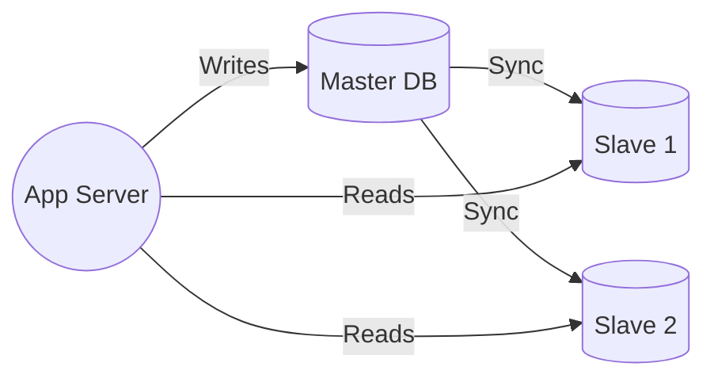

# 👯 HLD Deep Dive: Replication & Sharding (The Scale Masterclass)

Bhai, ek single database server ki limit hoti hai. Scale karne ke liye hum **Replication** aur **Sharding** use karte hain.

---

## 📖 1. The Core Difference (Analogy)

Maan lo aapke paas ek **Giant Warehouse (Database)** hai.


*   **Replication (The Backup Copy):** Aapne identical duplicate warehouse banaya.
    *   Agar pehla jal gaya → Dusre se saman milega. (Availability & Fault Tolerance).
    *   Agar bahut customers aa gaye → Dono se padhwa lo. (Read Scaling).


*   **Sharding (The Partition):** Aapne ek bade warehouse ki jagah 4 chote banaye.
    *   Warehouse 1: Electronics only.
    *   Warehouse 2: Clothes only.
    *   Customer "Shirt" maangtag hai → Seedha Warehouse 2.
    *   Isse poora system scale karta hai. (Write Scaling).


---

## 🏗️ 2. Replication: Master-Slave Architecture



*   **Master:** Sirf writes handle karta hai.

*   **Slaves:** Sirf reads handle karte hain. Master se sync rehte hain.

*   **Replication Lag:** Slave kabhi-kabhi 1-2 seconds peeche ho sakta hai. (Eventual Consistency).

*   **Interview Tip:** *"Sir, agar user ne abhi post kiya aur turant apna profile dekhne gaya, toh hum use Master se serve karenge, slaves se nahi. Isse 'Read-your-own-writes' consistency milti hai."*


---

## ✂️ 3. Sharding: The Write Scaling Solution

### A. How Shard Key Works
```javascript
const crypto = require('crypto');
const shardPool = ['db-shard-0', 'db-shard-1', 'db-shard-2'];

function getShard(userId) {
    const hash = crypto.createHash('md5').update(userId).digest('hex');
    const shardIndex = parseInt(hash.substring(0, 8), 16) % shardPool.length;
    console.log(`User ${userId} → ${shardPool[shardIndex]}`);
    return shardPool[shardIndex];
}

// Same userId will ALWAYS go to SAME shard!
getShard("user_123"); // → db-shard-1
getShard("user_123"); // → db-shard-1 (always same)
```

### B. Hotspot Problem (The Big Danger)
*   **Problem:** Agar aapne shard key "Country" rakha, toh India ke 90% users ek hi shard par aa jayenge. Wo shard "Hot" ho jayega aur phat jayega.
*   **Solution:** Hamesha **high-cardinality key** use karo jaise `user_id` ya `UUID`.


---

## 🔄 4. Consistent Hashing (The Smart Solution)

Bhai, normal hashing (`hash % N`) mein ek badi problem hai: jab naya server add karo, toh **sab ka data move** ho jata hai.

*   **Consistent Hashing:** Ek "Ring" imagine karo. Servers aur data dono ring par hain. Jab naya server aata hai, sirf uske paas wala data move hota hai (**1/N fraction only**).

*   **Real World:** Amazon DynamoDB, Discord, Cassandra sab consistent hashing use karte hain.

*   **Interview Answer:** *"Sir, hum Consistent Hashing use karenge taaki jab bhi server add ya remove ho, minimum data movement ho aur system ka performance stable rahe."*


---

## ⚔️ 5. The Interview War Room

**Q: Sharding ke baad Cross-Shard Queries kaise karoge?**

*"Sir, ye ek real problem hai. Agar mujhe sab users ki list chahiye jo Mumbai mein hain, toh mujhe saare shards query karne padenge aur results merge karne padenge. Ye expensive hai. Isliye hum important queries ke liye **Denormalization** ya **Secondary Indexes** (jaise Elasticsearch) use karte hain. Sharding ka mool mantra hai: zyataar queries ek hi shard par jayein."*


---

## 🌍 6. Real World: Instagram

Instagram ka entire media storage **PostgreSQL shards** par hai.

*   **Shard Key:** `user_id` → Ek user ki saari photos ek shard mein.
*   **Result:** Profile page load fast hota hai kyunki ek shard hi serve karta hai.


---

**Summary:** Replication = Read Scale + Safety. Sharding = Write Scale + Capacity! 🚀🔥👯
