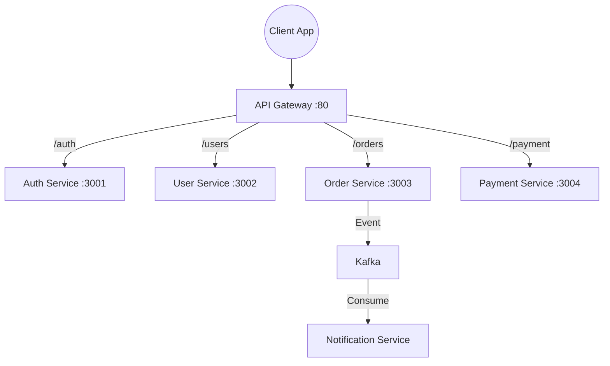

# 🏗️ HLD Deep Dive: Microservices (The Coordination Masterclass)

Bhai, Microservices ek badi "Sultanat" ko chote-chote "Independent States" mein baantna hai.

---

## 📖 1. The Analogy (The Hotel vs Special Forces)

### Monolith (The Old Hotel)
Ek bada hotel hai. 1 hi manager sab dekhta hai: Kitchen, Rooms, Accounts.
*   Manager bimaar hua → Poora hotel band.
*   Ek department busy hua → Sab slow.

### Microservices (The Special Forces)
Ab hotel ko alag teams mein baat diya:
*   **Team Kitchen:** Sirf khana banao.
*   **Team Laundry:** Sirf kapde saaf karo.
*   **Team Booking:** Sirf reservations sambhalo.
*   **Result:** Kitchen mein aag lagi → Laundry chal rahi hai. **Isolated Failures.**


---

## 🏗️ 2. Architecture: API Gateway + Services



*   **API Gateway:** Ek hi entry point. Auth, Rate Limiting, SSL Termination yahan hota hai.

*   **Services:** Har service ka apna database, apna deployment, apna scaling.


---

## 🛠️ 3. Node.js Code: API Gateway (Routing + Auth)

```javascript
const express = require('express');
const axios = require('axios');
const app = express();

const SERVICES = {
    AUTH:  'http://auth-service:3001',
    USER:  'http://user-service:3002',
    ORDER: 'http://order-service:3003'
};

// Middleware: Verify JWT Token
async function authenticate(req, res, next) {
    try {
        const token = req.headers['authorization'];
        await axios.post(`${SERVICES.AUTH}/verify`, { token });
        next(); // Token valid, aage jao
    } catch {
        res.status(401).json({ error: 'Unauthorized' });
    }
}

// Routes
app.get('/api/users/:id', authenticate, async (req, res) => {
    const response = await axios.get(`${SERVICES.USER}/users/${req.params.id}`);
    res.json(response.data);
});

app.post('/api/orders', authenticate, async (req, res) => {
    const response = await axios.post(`${SERVICES.ORDER}/orders`, req.body);
    res.json(response.data);
});

app.listen(80, () => console.log("🚀 API Gateway running on port 80"));
```


---

## 🔥 4. The Hard Problems (What Interviews Focus On)

### A. Distributed Transactions: The Saga Pattern
**Problem:** Order place hua → Payment deduct hua → Par Inventory update fail hua. Kya karein?

*   **Choreography Saga:** Har service ek event publish karti hai. Failure pe "Compensating Event" bhejti hai.
    *   OrderService → `order_created` event publish.
    *   PaymentService consume karta hai → Payment karta hai → `payment_done` publish.
    *   InventoryService consume karta hai → Fail hua → `inventory_failed` publish.
    *   PaymentService `inventory_failed` consume karta hai → **Refund** karta hai.

*   **Interview Answer:** *"Sir, hum Saga Pattern use karenge. Har step ek Kafka event hai. Agar koi step fail hota hai, toh 'Compensating Transaction' chalti hai jo pichla step undo karti hai."*


### B. Circuit Breaker Pattern
**Problem:** Payment service slow hai. Order service usse baar-baar call kar rahi hai aur wait kar rahi hai → **Cascading Failure**.

*   **Circuit Breaker:** Ek "Fuse" ki tarah kaam karta hai.
    *   **Closed (Normal):** Requests pass ho rahi hain.
    *   **Open (Tripped):** Service fail ho rahi hai. Hum usse **call karna band** kar dete hain aur turant fallback return karte hain.
    *   **Half-Open:** Thodi der baad ek test request bhejte hain. Agar succeed, circuit close ho jata hai.

```javascript
// Simple Circuit Breaker Logic
let failureCount = 0;
let circuitOpen = false;

async function callPaymentService(data) {
    if (circuitOpen) {
        return { error: "Payment service unavailable. Try later." }; // Fallback
    }
    try {
        const result = await axios.post('http://payment:3004/pay', data);
        failureCount = 0; // Reset on success
        return result.data;
    } catch {
        failureCount++;
        if (failureCount > 5) circuitOpen = true; // Trip the circuit
        throw new Error("Payment Failed");
    }
}
```


---

## ⚔️ 5. The Interview War Room

**Q: Microservices mein Service Discovery kaise hota hai?**

*"Sir, jab services dynamically scale hoti hain (naye instances aate-jaate rehte hain), toh hum unka IP hard-code nahi kar sakte. Iske liye **Service Registry (Consul/Eureka)** use karte hain. Har service start hone par register karti hai aur Gateway usse dhundh leta hai."*

**Q: Monolith vs Microservices - Kab kaunsa?**

| Factor | Monolith | Microservices |
| :--- | :--- | :--- |
| **Team Size** | Small (< 10 devs). | Large (Multiple teams). |
| **Scale** | Low to Medium. | High (Netflix, Amazon). |
| **Complexity** | Simple. | High (DevOps, Networking). |
| **Deployment** | Easy. | Complex (Kubernetes). |


---

## 🌍 6. Real World Case Study: Netflix

*   Netflix ke paas **1000+ Microservices** hain.

*   **Chaos Engineering:** Netflix apni khud ki services ko **randomly crash** karta hai production mein (Chaos Monkey) taaki system failure ke liye ready rahe.

*   **Hystrix:** Netflix ka Circuit Breaker library jo open-source bhi hai.


---

**Summary:** Microservices = Scale + Isolation. Circuit Breaker = No Cascading Failure! 🚀🔥🏗️
